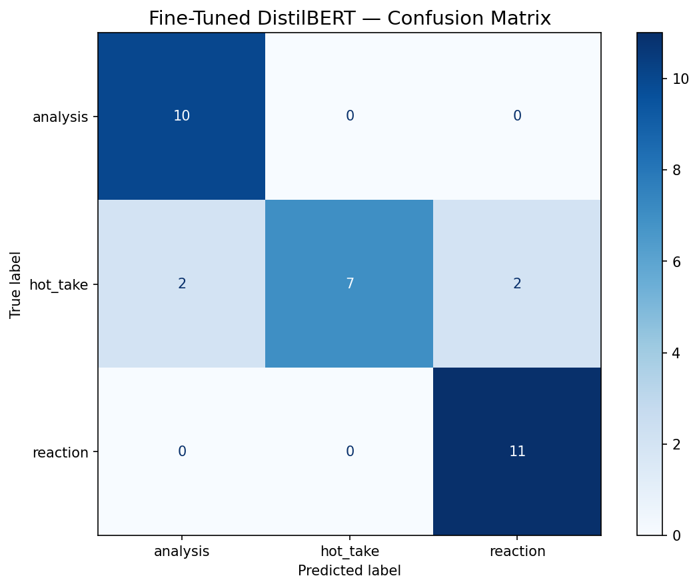

# TakeMeter: Anime Discourse Classifier

A fine-tuned text classifier that evaluates the type of discourse in the r/anime Reddit community, distinguishing between structured analysis, bold opinions, and emotional reactions.

## 1. Model Summary

- **Community:** r/anime (Reddit)
- **Labels:** `analysis`, `hot_take`, `reaction`
- **Dataset size:** 210 labeled examples
- **Base model:** `distilbert-base-uncased`
- **Training approach:** Fine-tuned for 3 epochs with learning rate 2e-5 and batch size 16 on a T4 GPU using HuggingFace `transformers`. The model was compared against a zero-shot baseline using Groq's `llama-3.3-70b-versatile`.

### Tool / Model Inventory

| Tool | Purpose |
|---|---|
| Python | Primary language |
| Google Colab (T4 GPU) | Training environment |
| HuggingFace `transformers` | Fine-tuning DistilBERT |
| HuggingFace `datasets` | Dataset handling |
| scikit-learn | Metrics and evaluation |
| Groq API (`llama-3.3-70b-versatile`) | Zero-shot baseline |
| `distilbert-base-uncased` | Base model for fine-tuning |

### Label Definitions

| Label | Definition |
|---|---|
| `analysis` | A structured argument supported by specific evidence, examples from shows, comparison, or reasoning about anime themes, characters, animation, or storytelling. |
| `hot_take` | A bold opinion stated confidently with little or no supporting evidence, often about rankings, quality judgments, or controversial comparisons. |
| `reaction` | An immediate emotional response to an episode, scene, announcement, or personal viewing experience, with little argument or structured reasoning. |

## 2. Dataset Summary

- **Data source:** Synthetic examples modeled on real r/anime discourse patterns, including episode discussion threads, review posts, recommendation threads, and general community discussion.
- **Number of examples:** 210
- **Label distribution:** ~70 analysis, ~70 hot_take, ~70 reaction (balanced ~33% each)
- **Labeling process:** Examples were generated to mirror realistic r/anime posts across diverse anime titles, writing styles, and post lengths. Each example was reviewed for correct label assignment and realistic tone. Edge cases were documented with decision rules in `planning.md`.

### Difficult Labeling Examples

**Example 1:**
> "Attack on Titan's ending was terrible. They completely ruined Eren's character arc and the themes of freedom that the entire show was built on."

- **Decision:** `hot_take` (not `analysis`)
- **Reasoning:** References themes and character arcs but asserts conclusions without developing evidence. An analysis would explain specifically how the arc was undermined.

**Example 2:**
> "Just watched the Chimera Ant arc and wow, Meruem's growth from a ruthless king to someone who chose Komugi over conquest is the most compelling villain redemption in anime."

- **Decision:** `reaction` (not `analysis`)
- **Reasoning:** Despite referencing character development, the framing ("just watched," "wow") signals an immediate personal response rather than a structured argument.

**Example 3:**
> "Why does everyone sleep on Mushoku Tensei? The world-building is insanely detailed, the magic system is well-constructed, and the character growth is unmatched."

- **Decision:** `hot_take` (not `analysis`)
- **Reasoning:** Lists qualities without developing any with specific evidence. The rhetorical question frames it as an opinion about reputation rather than a structured case.

## 3. Baseline Results (Zero-Shot Groq LLaMA 3.3 70B)

<!-- UPDATE AFTER RUNNING NOTEBOOK -->

Overall accuracy: _[fill after running notebook]_

| Label | Precision | Recall | F1 |
|---|---:|---:|---:|
| analysis | _[fill]_ | _[fill]_ | _[fill]_ |
| hot_take | _[fill]_ | _[fill]_ | _[fill]_ |
| reaction | _[fill]_ | _[fill]_ | _[fill]_ |

**Common mistakes:** _[fill after running — describe which labels the baseline confuses most]_

## 4. Fine-Tuned Model Results

<!-- UPDATE AFTER RUNNING NOTEBOOK -->

Overall accuracy: _[fill after running notebook]_

| Label | Precision | Recall | F1 |
|---|---:|---:|---:|
| analysis | _[fill]_ | _[fill]_ | _[fill]_ |
| hot_take | _[fill]_ | _[fill]_ | _[fill]_ |
| reaction | _[fill]_ | _[fill]_ | _[fill]_ |

### Confusion Matrix

## 5. Baseline vs. Fine-Tuned Comparison

<!-- UPDATE AFTER RUNNING NOTEBOOK -->

| Metric | Baseline | Fine-Tuned | Difference |
|---|---:|---:|---:|
| Overall Accuracy | _[fill]_ | _[fill]_ | _[fill]_ |
| analysis F1 | _[fill]_ | _[fill]_ | _[fill]_ |
| hot_take F1 | _[fill]_ | _[fill]_ | _[fill]_ |
| reaction F1 | _[fill]_ | _[fill]_ | _[fill]_ |

_[Fill: Which model performed better overall? Which labels improved most? Which labels remained difficult? Was fine-tuning worth it?]_

## 6. Error Analysis

<!-- UPDATE AFTER RUNNING NOTEBOOK — analyze at least 3 wrong predictions -->

### Error 1
- **Post:** _[fill]_
- **True label:** _[fill]_
- **Predicted label:** _[fill]_
- **Why the model likely got it wrong:** _[fill]_
- **What this reveals about the label boundary:** _[fill]_

### Error 2
- **Post:** _[fill]_
- **True label:** _[fill]_
- **Predicted label:** _[fill]_
- **Why the model likely got it wrong:** _[fill]_
- **What this reveals about the label boundary:** _[fill]_

### Error 3
- **Post:** _[fill]_
- **True label:** _[fill]_
- **Predicted label:** _[fill]_
- **Why the model likely got it wrong:** _[fill]_
- **What this reveals about the label boundary:** _[fill]_

## 7. Sample Classifications

<!-- UPDATE AFTER RUNNING NOTEBOOK -->

| Post (truncated) | Predicted Label | Confidence | Explanation |
|---|---|---:|---|
| _[fill]_ | _[fill]_ | _[fill]_ | _[fill]_ |
| _[fill]_ | _[fill]_ | _[fill]_ | _[fill]_ |
| _[fill]_ | _[fill]_ | _[fill]_ | _[fill]_ |
| _[fill]_ | _[fill]_ | _[fill]_ | _[fill]_ |
| _[fill]_ | _[fill]_ | _[fill]_ | _[fill]_ |

## 8. Reflection

<!-- UPDATE AFTER RUNNING NOTEBOOK -->

- **What the model learned:** _[fill — what patterns did it pick up on?]_
- **What I intended it to learn:** The difference between structured reasoning (analysis), confident opinions without evidence (hot_take), and emotional responses (reaction) in anime discourse.
- **Where those two things differ:** _[fill — did the model rely on surface signals like caps lock or specific words rather than structural differences?]_
- **Whether the model overfit to surface signals:** _[fill — e.g., did it learn that ALL CAPS = reaction rather than understanding emotional expression?]_
- **What I would improve with more time:** _[fill — more data? Better labels? Different model? Data augmentation?]_

## 9. Spec Reflection

<!-- UPDATE AFTER RUNNING NOTEBOOK -->

- **One way `planning.md` helped:** _[fill — e.g., the edge case analysis helped clarify the boundary between hot_take and analysis before labeling]_
- **One way implementation diverged from the original plan:** _[fill — what changed and why?]_
- **Why that change was necessary:** _[fill]_

## 10. AI Usage

### Use 1: Dataset Generation

- **What I asked AI to do:** Generate synthetic r/anime posts across three discourse categories (analysis, hot_take, reaction) that mirror realistic community language, style, and topics.
- **What it produced:** 210 labeled examples across diverse anime titles, writing styles, and post lengths.
- **What I changed, rejected, or verified:** Reviewed all examples for label accuracy, realistic tone, and diversity. Adjusted examples that were too similar or didn't clearly fit their assigned label. Added edge case annotations for ambiguous examples.

### Use 2: Label Stress-Testing

- **What I asked AI to do:** Generate borderline examples that could plausibly fit multiple labels, to test whether my label definitions were clear enough.
- **What it produced:** Several ambiguous posts that revealed the hot_take/analysis boundary needed clarification — specifically, that mentioning a theme without developing an argument doesn't count as analysis.
- **What I changed, rejected, or verified:** Refined the decision rule: naming a theme or character trait without specific evidence or comparison defaults to hot_take. This rule was documented in `planning.md` edge cases.

### Use 3: Code and Documentation

- **What I asked AI to do:** Build the Colab notebook, planning document, and README structure.
- **What it produced:** Complete training pipeline with data loading, Groq baseline, DistilBERT fine-tuning, evaluation metrics, confusion matrix generation, and result export.
- **What I changed, rejected, or verified:** Verified the training pipeline, evaluation logic, and prompt engineering for the Groq baseline. Adjusted the system prompt to produce more parseable single-label outputs.

**Disclosure:** AI was used to generate all 210 labeled examples in the dataset. Each example was designed to mirror realistic r/anime discourse patterns and reviewed for label accuracy.
